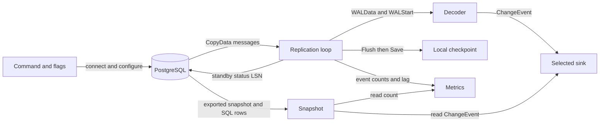
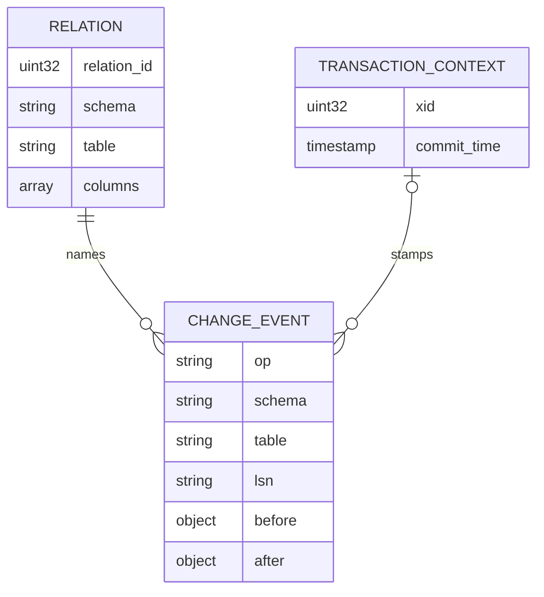
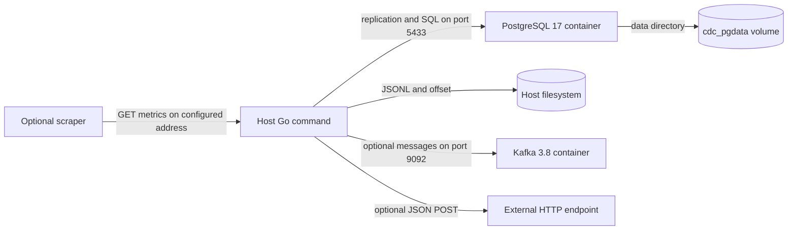

# Architecture

## Overview

One command wires small internal packages around a synchronous replication loop. PostgreSQL supplies both the initial consistent view and subsequent `pgoutput` messages; the same `ChangeEvent` and `Sink` interface join the two paths ([wiring](../../cmd/cdc/main.go#L40), [event](../../internal/event/event.go#L19), [sink](../../internal/sink/sink.go#L12)).

## Components

| Component | Responsibility | Lives in | Talks to |
| --- | --- | --- | --- |
| Command | Parse flags, establish lifetime, select startup branch. | [`cmd/cdc/`](../../cmd/cdc/) · [map](03-structure.md#command) | Every runtime package through [`run`](../../cmd/cdc/main.go#L40). |
| Configuration | Collect CLI options and split lists. | [`internal/config/`](../../internal/config/) · [map](03-structure.md#configuration) | Command via [`Parse`](../../internal/config/config.go#L41). |
| Publication | Create/replace a table-scoped publication when requested. | [`internal/publication/`](../../internal/publication/) · [map](03-structure.md#publication) | PostgreSQL SQL connection via [`Ensure`](../../internal/publication/publication.go#L18). |
| Replication | Slot creation, snapshot export, stream, feedback and checkpoint ordering. | [`internal/replication/`](../../internal/replication/) · [map](03-structure.md#replication) | PostgreSQL, decoder, sink, callback, metrics via [`Stream`](../../internal/replication/replication.go#L111). |
| Snapshot | Import the slot's snapshot and read publication tables. | [`internal/snapshot/`](../../internal/snapshot/) · [map](03-structure.md#snapshot) | SQL connection and selected sink via [`Run`](../../internal/snapshot/snapshot.go#L58). |
| Decoder | Cache relation metadata and translate tuple values. | [`internal/decode/`](../../internal/decode/) · [map](03-structure.md#decoder) | Stream through [`Process`](../../internal/decode/decode.go#L42). |
| Event model | Shared row-change envelope and operation names. | [`internal/event/`](../../internal/event/) · [map](03-structure.md#event-model) | Snapshot, decoder, sinks through [`ChangeEvent`](../../internal/event/event.go#L19). |
| Sinks | Serialize/buffer events and flush to one destination. | [`internal/sink/`](../../internal/sink/) · [map](03-structure.md#sinks) | Files, stdout, HTTP, or Kafka through [`New`](../../internal/sink/factory.go#L17). |
| Checkpoint | Load/save a single LSN in a local file. | [`internal/checkpoint/`](../../internal/checkpoint/) · [map](03-structure.md#checkpoint) | Command and callback through [`Store`](../../internal/checkpoint/checkpoint.go#L16). |
| Metrics | Register counters/gauge and optionally serve `/metrics`. | [`internal/metrics/`](../../internal/metrics/) · [map](03-structure.md#metrics) | Prometheus registry and HTTP through [`Serve`](../../internal/metrics/metrics.go#L34). |

## Boundaries and contracts

- **PostgreSQL connections:** `Connect` adds `replication=database`; publication and snapshot each open normal SQL connections from the original DSN ([replication](../../internal/replication/replication.go#L36), [publication](../../internal/publication/publication.go#L23), [snapshot](../../internal/snapshot/snapshot.go#L59)). `START_REPLICATION` requests `pgoutput` protocol version 1 and one publication ([arguments](../../internal/replication/replication.go#L113)). Connection authentication is delegated to pgx/pgconn; the application defines no separate authentication flow.
- **Events:** `op`, `schema`, `table`, and string `lsn` identify the change; optional `before`, `after`, `xid`, and `commit_time` carry row and transaction context ([schema](../../internal/event/event.go#L19)). `read` events have an `after` image and the slot's consistent-point LSN but no transaction metadata ([snapshot construction](../../internal/snapshot/snapshot.go#L115)). There is no event UUID or transaction envelope.
- **Row values:** live decoding converts booleans, integers, floats, and JSON/JSONB, retaining other types as strings. NULL becomes `nil`, unchanged TOAST values are omitted, and before-images depend on replica identity ([conversion](../../internal/decode/decode.go#L140), [old tuples](../../internal/decode/decode.go#L83)). Snapshot values instead come from pgx's `rows.Values`, so identical JSON representation across both paths is not explicitly enforced ([copy](../../internal/snapshot/snapshot.go#L111)).
- **Sink:** `Write` may buffer; `Flush` is intended to make prior writes durable; `Close` flushes and releases resources ([interface](../../internal/sink/sink.go#L10)). File output syncs the file; stdout merely flushes; HTTP relies on endpoint acceptance; Kafka relies on `WriteMessages` success ([file](../../internal/sink/file.go#L40), [stdout](../../internal/sink/stdout.go#L33), [HTTP](../../internal/sink/http.go#L35), [Kafka](../../internal/sink/kafka.go#L49)). The interface's stated guarantee is stronger than what every implementation independently proves.
- **Checkpoint callback:** the stream receives a function, not a store, and calls it between sink flush and server feedback ([type](../../internal/replication/replication.go#L109), [ordering](../../internal/replication/replication.go#L205)). The command always supplies `cp.Save` ([call](../../cmd/cdc/main.go#L126)).

## Data model

This is an event envelope plus session state, not an application-owned relational schema. The diagram shows logical associations, not database foreign keys: relation and transaction metadata are copied into emitted events ([decoder state](../../internal/decode/decode.go#L26), [event construction](../../internal/decode/decode.go#L121)).

| Entity | Stored in | Key fields | Defined at |
| --- | --- | --- | --- |
| Source row | User-selected PostgreSQL tables | Arbitrary columns; demo uses `id`, `name`, `price`, `tags`. | [`demo.sh:16`](../../scripts/demo.sh#L16) |
| Change event | Selected destination | Operation, table identity, LSN, row images, optional transaction metadata. | [`event.go:19`](../../internal/event/event.go#L19) |
| Relation cache and transaction context | Process memory | Relation ID to column metadata; current XID and commit time. | [`decode.go:26`](../../internal/decode/decode.go#L26) |
| Slot descriptor | Returned by slot creation; slot itself lives in PostgreSQL | Created flag, consistent point, exported snapshot name. | [`replication.go:63`](../../internal/replication/replication.go#L63) |
| Checkpoint | `<output>.offset` | One textual LSN; no source/destination identity. | [`checkpoint.go:24`](../../internal/checkpoint/checkpoint.go#L24), [`main.go:99`](../../cmd/cdc/main.go#L99) |

## State and persistence

The persistent PostgreSQL slot retains progress server-side; the local checkpoint can override the requested start position ([slot creation](../../internal/replication/replication.go#L83), [resume precedence](../../cmd/cdc/main.go#L111)). File output is append-only and fsynced on flush, whereas the checkpoint uses write-and-rename without explicit fsync ([file](../../internal/sink/file.go#L20), [checkpoint](../../internal/checkpoint/checkpoint.go#L41)). Decoder metadata, sink buffers, counters, and the processed position live only in memory ([decoder](../../internal/decode/decode.go#L26), [HTTP buffer](../../internal/sink/http.go#L16), [Kafka buffer](../../internal/sink/kafka.go#L17), [position](../../internal/replication/replication.go#L124)). See [open questions](README.md#open-questions) before relying on crash recovery.

## Deployment

Compose defines PostgreSQL with logical WAL and ten sender/slot limits, a named database volume, and a single-node KRaft Kafka broker with plaintext localhost advertisement; it does not define a CDC application container, HTTP destination, or Prometheus service ([Compose](../../docker-compose.yml#L1)). Kafka has no explicit volume in this file. The Go process is launched on the host through `go run`; `make build` runs `go build ./...` without defining a named deployable artifact ([Makefile](../../Makefile#L12)).

## Failure and scale

- **Failing stream or sink:** most errors propagate out of the single receive loop and terminate the command. There is no outer reconnect/backoff supervisor ([loop](../../internal/replication/replication.go#L129), [exit](../../cmd/cdc/main.go#L34)). HTTP and Kafka retain buffers after unsuccessful flushes, and deferred `Close` may try flushing again; retained buffers are not a durable queue ([HTTP](../../internal/sink/http.go#L48), [Kafka](../../internal/sink/kafka.go#L59), [defer](../../cmd/cdc/main.go#L92)).
- **Blocked destination:** synchronous flush pauses receiving. HTTP has a 30-second client timeout; Kafka uses a 30-second context and up to five explicit attempts for unknown-topic errors ([HTTP](../../internal/sink/http.go#L27), [Kafka](../../internal/sink/kafka.go#L53)).
- **Large snapshot or busy stream:** HTTP/Kafka buffers have no application batch-size limit; snapshot copying never calls `Flush`. Memory demand can therefore grow with the entire initial snapshot, and sink latency limits throughput ([snapshot loop](../../internal/snapshot/snapshot.go#L88), [HTTP append](../../internal/sink/http.go#L30), [Kafka append](../../internal/sink/kafka.go#L36)).
- **Parallelism:** one configured slot and one sink feed one serial loop. There is no worker pool or coordinated sharding; distinct process configurations would need independent slot/output ownership and table scope ([config](../../internal/config/config.go#L11), [stream](../../internal/replication/replication.go#L129)). Kafka hashes `schema.table`, grouping a table's messages rather than spreading its rows across keys ([writer](../../internal/sink/kafka.go#L28), [key](../../internal/sink/kafka.go#L41)).
- **Observability failure:** metrics listen errors are logged in a goroutine without stopping capture; event counters increment on `Write` success before durability, and lag uses the processed position ([server](../../internal/metrics/metrics.go#L40), [event count and lag](../../internal/replication/replication.go#L185)).
