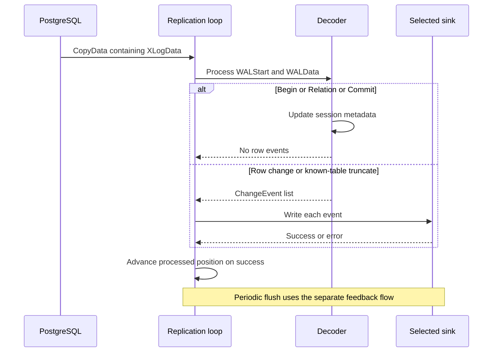
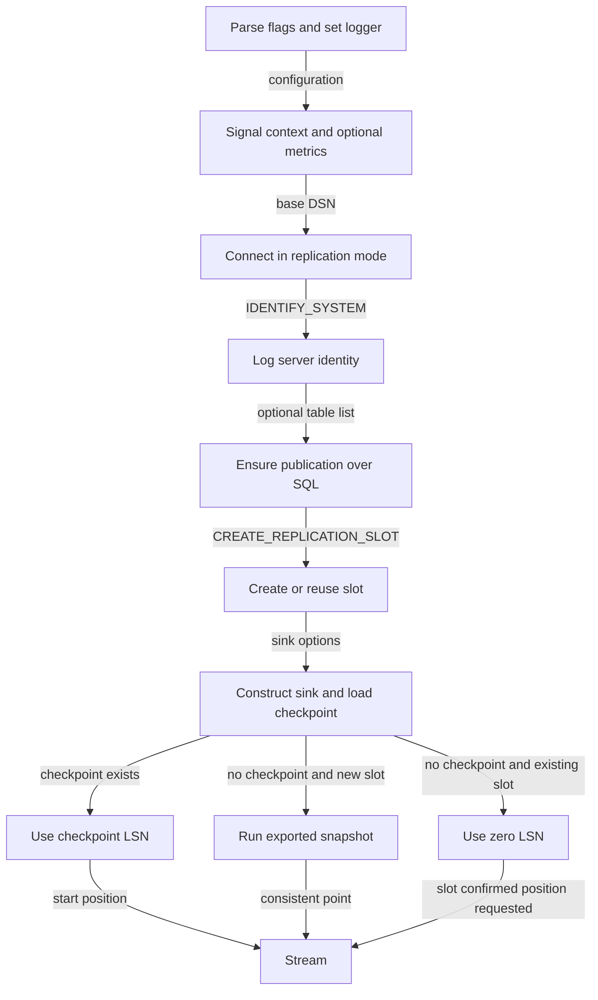
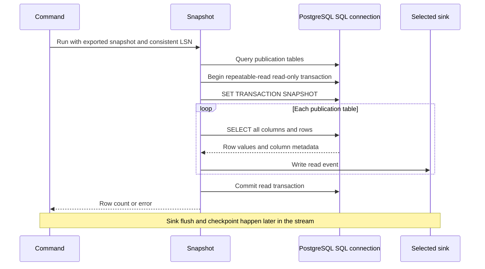
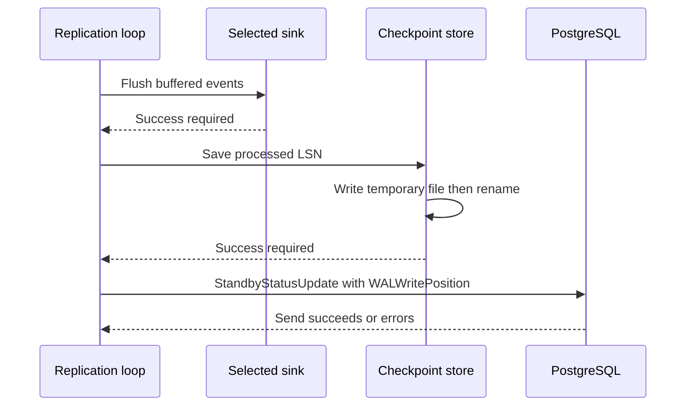
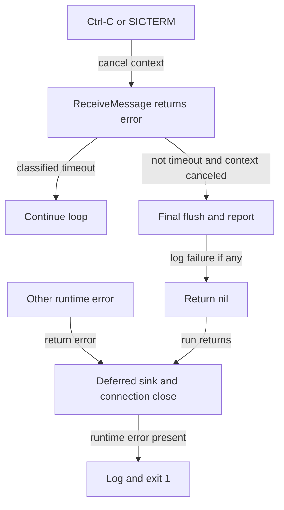
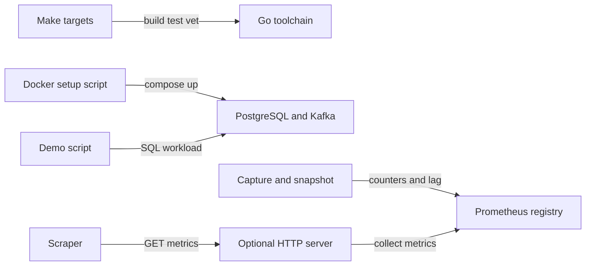

# Flow

The command's main output is a sequence of events, not an HTTP response. Follow [startup](#startup) and, when selected, [initial snapshot](#initial-snapshot) before entering the live loop ([wiring](../../cmd/cdc/main.go#L105)).

## Live capture

1. **Start replication:** `Stream` sends `START_REPLICATION` with the selected slot, starting LSN, protocol version 1, and publication. It creates a decoder, initializes the processed position to the start LSN, and sets a ten-second feedback deadline. [`replication.go:111`](../../internal/replication/replication.go#L111) · [structure](03-structure.md#replication).
2. **Receive and classify:** receive with the feedback deadline; timeout loops back, non-`CopyData` messages are warned about, and keepalives versus XLogData select separate branches. A keepalive updates lag; `ReplyRequested` makes the next feedback deadline immediate. [`replication.go:139`](../../internal/replication/replication.go#L139) · [structure](03-structure.md#replication).
3. **Parse payload:** `ParseXLogData` yields WAL position and logical payload; `Decoder.Process` calls `pglogrepl.Parse` and dispatches the result. Parse errors return from capture. [`replication.go:176`](../../internal/replication/replication.go#L176), [`decode.go:42`](../../internal/decode/decode.go#L42) · [replication structure](03-structure.md#replication), [decoder structure](03-structure.md#decoder).
4. **Apply framing:** Begin sets XID/commit time, Relation caches table/column metadata, and Commit clears transaction metadata. These messages produce no event. [`decode.go:54`](../../internal/decode/decode.go#L54) · [structure](03-structure.md#decoder).
5. **Construct row changes:** insert sets `after`, update sets `after` and any supplied `before`, delete sets any supplied `before`, and truncate emits one event per cached relation. Unknown relations error for row changes but are silently skipped for truncate. Values are mapped by column position and converted by OID. [`decode.go:69`](../../internal/decode/decode.go#L69), [`decode.go:140`](../../internal/decode/decode.go#L140) · [structure](03-structure.md#decoder).
6. **Write the selected destination:** the loop calls `Sink.Write` for each event and increments its operation counter after success. File/stdout serialize JSONL into buffers; HTTP holds event objects; Kafka serializes messages with a table key and fixed or per-table topic. [`replication.go:185`](../../internal/replication/replication.go#L185), [`file.go:28`](../../internal/sink/file.go#L28), [`stdout.go:22`](../../internal/sink/stdout.go#L22), [`http.go:30`](../../internal/sink/http.go#L30), [`kafka.go:36`](../../internal/sink/kafka.go#L36) · [replication structure](03-structure.md#replication), [sink structure](03-structure.md#sinks).
7. **Advance in memory:** after the payload's events are written, set the processed position to `WALStart + len(WALData)` and update lag. This happens for framing payloads as well as row changes; it is not a commit-boundary check. The next receive/feedback iteration follows. [`replication.go:192`](../../internal/replication/replication.go#L192) · [structure](03-structure.md#replication). See [restart correctness](README.md#open-questions).

## Startup

1. **Parse and log:** CLI flags populate `Config`; parse errors exit 2. `--verbose` selects debug logging; runtime errors are logged and exit 1. [`main.go:21`](../../cmd/cdc/main.go#L21), [`config.go:41`](../../internal/config/config.go#L41) · [command](03-structure.md#command), [configuration](03-structure.md#configuration).
2. **Establish lifetime:** Ctrl-C/SIGTERM cancels the main context. Optional metrics start independently. [`main.go:40`](../../cmd/cdc/main.go#L40), [`metrics.go:34`](../../internal/metrics/metrics.go#L34) · [command](03-structure.md#command), [metrics](03-structure.md#metrics).
3. **Connect and identify:** add the replication runtime parameter, open pgconn, issue `IDENTIFY_SYSTEM`, and log server information. Identity is not compared with checkpoint contents. [`main.go:47`](../../cmd/cdc/main.go#L47), [`replication.go:36`](../../internal/replication/replication.go#L36) · [command](03-structure.md#command), [replication](03-structure.md#replication).
4. **Apply table scope:** `Ensure` is a no-op for an empty `--tables`. Otherwise, open SQL, quote identifiers, inspect publication existence, and create it or replace its table set. The default unscoped publication must already exist. [`publication.go:18`](../../internal/publication/publication.go#L18) · [structure](03-structure.md#publication).
5. **Create/reuse slot:** create a persistent `pgoutput` slot with `EXPORT_SNAPSHOT`. A duplicate-object error means reuse, returning no snapshot or consistent point. Other errors abort startup. [`replication.go:83`](../../internal/replication/replication.go#L83) · [structure](03-structure.md#replication).
6. **Prepare sink/checkpoint:** construct the selected sink, defer its close, then load `<output>.offset`. Missing checkpoint is allowed; unreadable or malformed content aborts. [`main.go:82`](../../cmd/cdc/main.go#L82), [`factory.go:17`](../../internal/sink/factory.go#L17), [`checkpoint.go:24`](../../internal/checkpoint/checkpoint.go#L24) · [command](03-structure.md#command), [sinks](03-structure.md#sinks), [checkpoint](03-structure.md#checkpoint).
7. **Choose start path:** a checkpoint always wins and skips snapshot; a new slot without a checkpoint runs the initial copy; a reused slot without a checkpoint passes zero to request its confirmed position. Snapshot must finish before streaming invalidates its exported view. [`main.go:105`](../../cmd/cdc/main.go#L105), [`replication.go:79`](../../internal/replication/replication.go#L79) · [command](03-structure.md#command), [replication](03-structure.md#replication).

## Initial snapshot

1. **Open a separate SQL connection:** list publication tables, ordered by schema/table, before beginning the transaction. [`snapshot.go:58`](../../internal/snapshot/snapshot.go#L58), [`snapshot.go:28`](../../internal/snapshot/snapshot.go#L28) · [structure](03-structure.md#snapshot).
2. **Import consistent view:** begin read-only repeatable-read, arrange rollback on exit, and import the exported snapshot as the first transaction statement. [`snapshot.go:72`](../../internal/snapshot/snapshot.go#L72) · [structure](03-structure.md#snapshot).
3. **Copy each table:** quote the schema/table identifier, issue `SELECT *`, map column names to pgx values, and emit `read` events at the supplied consistent-point LSN. Each successful write increments the read counter. Rows within a table have no explicit order. [`snapshot.go:100`](../../internal/snapshot/snapshot.go#L100) · [structure](03-structure.md#snapshot).
4. **Return to live capture:** after all tables, commit the read transaction and return; the command calls `Stream` at the consistent point. There is no snapshot-local flush, checkpoint, or completion marker. [`snapshot.go:88`](../../internal/snapshot/snapshot.go#L88), [`main.go:115`](../../cmd/cdc/main.go#L115) · [snapshot](03-structure.md#snapshot), [command](03-structure.md#command).

## Flush and feedback

1. **Trigger:** the ten-second deadline, or a keepalive asking for a reply, causes `flushAndReport` before the next receive. Signal shutdown can call the same helper. [`replication.go:129`](../../internal/replication/replication.go#L129), [`replication.go:172`](../../internal/replication/replication.go#L172) · [structure](03-structure.md#replication).
2. **Flush destination:** file flushes and fsyncs; stdout flushes its writer; HTTP POSTs a JSON array and clears it after an accepted response; Kafka writes its buffered messages and clears only on success. A failure prevents this invocation from saving or reporting the new position. [`replication.go:205`](../../internal/replication/replication.go#L205), [`file.go:40`](../../internal/sink/file.go#L40), [`stdout.go:33`](../../internal/sink/stdout.go#L33), [`http.go:35`](../../internal/sink/http.go#L35), [`kafka.go:49`](../../internal/sink/kafka.go#L49) · [replication](03-structure.md#replication), [sinks](03-structure.md#sinks).
3. **Save local position:** invoke the callback, which writes a textual LSN to `<checkpoint>.tmp` and renames it to the checkpoint path. No explicit sync follows. [`replication.go:212`](../../internal/replication/replication.go#L212), [`checkpoint.go:41`](../../internal/checkpoint/checkpoint.go#L41) · [replication](03-structure.md#replication), [checkpoint](03-structure.md#checkpoint).
4. **Report to server:** call `SendStandbyStatusUpdate`, setting `WALWritePosition`; the other fields are left to library defaults. Any send error propagates, even though the local sink and checkpoint steps have already completed. [`replication.go:217`](../../internal/replication/replication.go#L217) · [structure](03-structure.md#replication).

## Shutdown and errors

1. **Cancel:** the signal context reaches connection, snapshot, and streaming operations. Sink calls have no context parameter; HTTP/Kafka use their own timeouts. [`main.go:42`](../../cmd/cdc/main.go#L42), [`sink.go:12`](../../internal/sink/sink.go#L12), [`http.go:27`](../../internal/sink/http.go#L27), [`kafka.go:53`](../../internal/sink/kafka.go#L53) · [command](03-structure.md#command), [sinks](03-structure.md#sinks).
2. **Handle receive failure:** timeout classification is checked before context cancellation. If the cancellation branch is reached, flush/report with a background context, log any failure, and return nil. Cancellation during other operations can instead propagate as an error. [`replication.go:143`](../../internal/replication/replication.go#L143) · [structure](03-structure.md#replication).
3. **Clean up:** deferred sink close runs before replication connection close. Sink close errors are logged without replacing the returned error; the command exits 1 only when `run` returned an error. [`main.go:34`](../../cmd/cdc/main.go#L34), [`main.go:52`](../../cmd/cdc/main.go#L52), [`main.go:92`](../../cmd/cdc/main.go#L92) · [structure](03-structure.md#command).

## Metrics and local development

1. **Build/check:** `make build`, `test`, and `vet` run the corresponding Go commands against all packages. There is no tracked CI workflow in this checkout. [`Makefile:12`](../../Makefile#L12) · [structure](03-structure.md#root).
2. **Prepare demo services:** the Docker setup script starts all Compose services, then inspects PostgreSQL health; first database initialization creates the default publication. The Homebrew alternative modifies logical-WAL settings and restarts PostgreSQL. [`setup_pg_docker.sh:11`](../../scripts/setup_pg_docker.sh#L11), [`init_pg.sql:5`](../../scripts/init_pg.sql#L5), [`setup_pg.sh:27`](../../scripts/setup_pg.sh#L27) · [structure](03-structure.md#scripts).
3. **Generate traffic:** the demo creates `products` with full replica identity, then issues insert/update/delete/truncate SQL. [`demo.sh:14`](../../scripts/demo.sh#L14) · [structure](03-structure.md#scripts).
4. **Observe:** metrics collectors register at package initialization; a nonempty listen address starts a `/metrics` goroutine. Successful writes increment events, sink write/flush errors increment failures, and received WAL/keepalives update lag. Metrics server failure only logs. [`metrics.go:13`](../../internal/metrics/metrics.go#L13), [`metrics.go:34`](../../internal/metrics/metrics.go#L34), [`replication.go:170`](../../internal/replication/replication.go#L170), [`replication.go:205`](../../internal/replication/replication.go#L205), [`snapshot.go:122`](../../internal/snapshot/snapshot.go#L122) · [metrics](03-structure.md#metrics), [replication](03-structure.md#replication), [snapshot](03-structure.md#snapshot).
